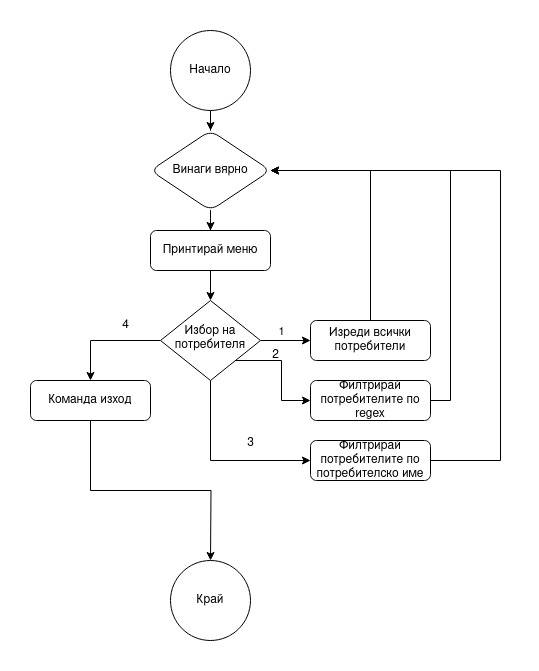

# CSCB534 Проект: Операционни системи (UNIX/Linux)
### Георги Ивов Димитров - F9722
## Задание
> Изгответе скрипт с меню за филтриране на всички потребители в сървъра и филтрирането на тези, които имат 1 в потребителското си име. Работете в Linux. 
## Първоначална настройка на работна среда
Работата ми по заданието започна със създаването и настройването на нужната за изпълнението на задачата работна среда. 
Тъй като основната и най-мощната компютърна система на мое разположение работи с Windows 10, удобния и удачен вариант е да настоя една виртуална десктоп среда, като за това използвах Oracle VirtualBox версия `7.0.10`.

Изборът на Linux дистрибуция, която да ползвам за създаването и тестването на този скрипт няма пряко влияние върху командите в него, тъй като за работата му са нужни стандартни команди, налични в (почти) всички UNIX-like операционни системи. В този случай, избрах да ползвам Linux Mint, по-точно `21.2 Cinnamon` версията, защото предоставя добър графичен интерфейс, с когото съм сравнително запознат, а имам и сървър под него, който хоства няколко web приложения за лично ползване.

Създадох виртуалната машина като отделих `8GB` RAM памет, 6 процесорни ядра и `50GB` виртуално място за съхранение. За разработването/тестването/позлването на този скрипт, тези параметри за повече от достатъчни, но изпозлвах виртуалната машина и за други цели (браузър, git, vs code IDE etc.).

Инсталацията на операционната система протече изключително лесно благодарение на добрия графичен инсталационен гид. Той създаде минимално нужните два `Ext4` и `FAT` дяла, попита за login детайлите на главния потребител (потребителско име, парола), както и за самата система (network name). След бърз рестарт, операционната система беше инсталирана на виртуалната памет за съхранение. 

За удобство, инсталирах и така наречените `гост допълнения`, софтуер, който подобрява комуникациите между хост софтуера (`Virtual Box`) и операционната система във виртуалната машина. Това отключи функции като споделен буфер за копиране и поставяне, както и активно оразмеряване на изходната резолюция на виртуализираната операционната система спрямо размера на прозореца на виртуалната система в хост операционната система.

След тези стъпки, системата и работната среда беше готова за ползване, и разработката на скрипта можеше да започне.

## Разработка
За улеснение на потребителите, реших скирпта да предостави меню с наличните опции, с кратко описание и индекси, които да послужат за потребителски input. Ако той е валиден, скиптът продължава към избраната функция, а в противен случай, информира потребителя за невалидня параметър и отново презенитра менюто с молба за нов избор.

Следното представлява flowchart на процеса на скрипта:

